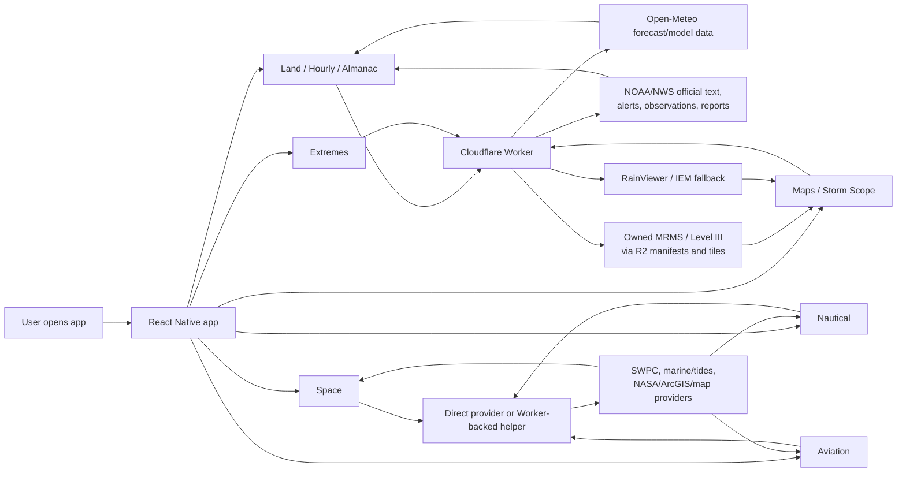
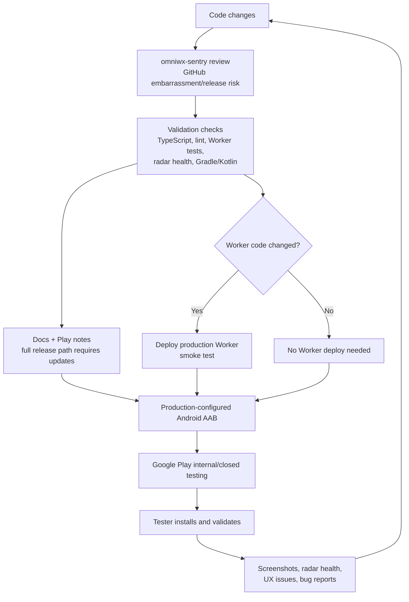

# OMNIwx App Architecture

Last updated: September 12, 2026

This is the full-app architecture view. The radar subsystem has its own deeper diagram in [radar-architecture.md](radar-architecture.md).

## Current Architecture

```mermaid
flowchart TB
  subgraph Clients["Client Surfaces"]
    Android["Android app\nExpo / React Native"]
    Play["Google Play\ninternal / closed testing"]
    Website["omni-wx.com\nSquarespace / Cloudflare DNS"]
  end

  subgraph AppShell["Mobile App"]
    Tabs["Primary tabs\nLand, Hourly, Almanac, Maps,\nSpace, Nautical, Aviation, Extremes"]
    State["Client state\nsettings, saved locations,\nmap/layer selections"]
    UI["Design system in progress\nbrand guide, themed cards,\nmap HUDs, release notes"]
  end

  subgraph Worker["Cloudflare Worker: omniwx-api"]
    Api["API routes\nforecast, radar, alerts,\nweather summaries, provider proxying"]
    Cache["Worker/edge caching\nrate-limit protection and normalized responses"]
    SourceSelect["Source selection\nowned when healthy,\nfallback when stale/unavailable"]
    Health["Health/status routes\nradar posture, backend status,\nrelease validation"]
  end

  DirectHelpers["Direct provider or\nWorker-backed helpers\nfor specialty features"]

  subgraph Storage["Cloudflare Storage"]
    R2["R2\nowned radar tiles + manifests\nrolling retention only"]
    D1["D1 dev/prod\nfuture user/app data\nnot radar hot path"]
  end

  subgraph External["External Weather/Data Providers"]
    OpenMeteo["Open-Meteo\nforecast/model data"]
    NWS["NOAA / NWS\nalerts, AFD/HWO, observations,\nstorm reports"]
    RadarFallbacks["RainViewer + IEM/RIDGE\nradar fallback"]
    NOAAOwned["NOAA MRMS + NEXRAD Level III\nowned radar inputs"]
    Specialty["NOAA SWPC, marine/tides,\nNASA imagery, ArcGIS/fire,\nmap imagery providers"]
  end

  subgraph Automation["Automation + Release"]
    GitHub["GitHub Actions\nWorker deploy, radar jobs,\nhealth checks"]
    RadarJobs["MRMS + Level III beta publishers\nsuccessful but schedule-unreliable"]
    Release["Full release path\nversion bump, docs, checks,\nAAB build, Play notes"]
    SentrySkill["omniwx-sentry skill\nrelease/code/security review"]
  end

  subgraph Future["Future Commercial Layer"]
    Auth["Auth/login\nnot enabled yet"]
    Billing["Payments/subscriptions\nplanned after LLC"]
    Runner["Dedicated radar runner\nproduction-grade radar cadence"]
    Observability["Operational monitoring\nbudget alerts, health, incidents"]
  end

  Android --> Tabs
  Tabs --> State
  Tabs --> UI
  Tabs --> Api
  Tabs --> DirectHelpers
  Api --> Cache
  Api --> SourceSelect
  Api --> Health
  Api --> OpenMeteo
  Api --> NWS
  Api --> RadarFallbacks
  Api --> Specialty
  DirectHelpers --> Specialty
  SourceSelect --> R2
  NOAAOwned --> RadarJobs
  RadarJobs --> R2
  GitHub --> RadarJobs
  GitHub --> Release
  GitHub --> Api
  Release --> Play
  SentrySkill --> Release
  D1 -. "future users/subscriptions/preferences" .-> Api
  Website --> Clients
  Auth -. "future" .-> D1
  Billing -. "future" .-> D1
  Runner -. "replaces GitHub radar schedule" .-> R2
  Runner -. "uses NOAA owned inputs" .-> NOAAOwned
  Observability -. "future production ops" .-> Worker
  Observability -. "budget/storage limits" .-> Storage

  classDef client fill:#183d2c,stroke:#66e0a3,color:#fff;
  classDef worker fill:#113a5c,stroke:#58b9ff,color:#fff;
  classDef storage fill:#403414,stroke:#f4c95d,color:#fff;
  classDef external fill:#24334d,stroke:#7aa6ff,color:#fff;
  classDef automation fill:#35224d,stroke:#c09cff,color:#fff;
  classDef future fill:#4b3420,stroke:#ffb45c,color:#fff;

  class Android,Play,Website,Tabs,State,UI client;
  class Api,Cache,SourceSelect,Health,DirectHelpers worker;
  class R2,D1 storage;
  class OpenMeteo,NWS,RadarFallbacks,NOAAOwned,Specialty external;
  class GitHub,RadarJobs,Release,SentrySkill automation;
  class Auth,Billing,Runner,Observability future;
```

## Data Flow By Feature Area

## Release And Safety Flow

## Current Source Of Truth

- Mobile app: `app/`, `components/`, `hooks/`, `styles/`, `constants/`.
- Worker/API: `omniwx-api/`.
- Android release build: `android/`.
- Automation: `.github/workflows/`.
- User-facing docs and plans: `docs/`.
- Radar architecture: [radar-architecture.md](radar-architecture.md).
- Release checklist: [full-release-path.md](full-release-path.md).
- Production readiness: [production-readiness-plan.md](production-readiness-plan.md).
- Brand direction: [brand-style-guide.md](brand-style-guide.md).

## Architectural Principles

- The app should call OMNIwx-controlled routes for anything that needs caching, rate-limit protection, source selection, or fallback behavior.
- Public providers remain useful, but the app should not be fragile if one provider is stale, limited, or unavailable.
- Radar tiles belong in R2 with rolling retention, not D1.
- D1 should be reserved for structured app/user data, future auth/subscription state, preferences, and lightweight metadata.
- GitHub Actions is acceptable for builds, deployments, validation, and beta radar publishing, but not for production-grade radar freshness.
- The full release path should always keep docs, Play notes, versioning, checks, and AAB output aligned.
- Commercial/paywall work should wait for LLC/payment readiness, but the architecture can prepare for auth, entitlement, and data separation now.

## Major Gaps Before Paid Customers

- Dedicated radar runner for reliable MRMS/Level III freshness.
- Auth/account/subscription architecture decision.
- Cost safety gates before scaling traffic or paid features.
- Security questionnaire readiness, key audit, RLS/data-access policy, and incident/backup strategy.
- More consistent app-wide theme system and component hierarchy.
- Production observability that catches stale data before users report it.
