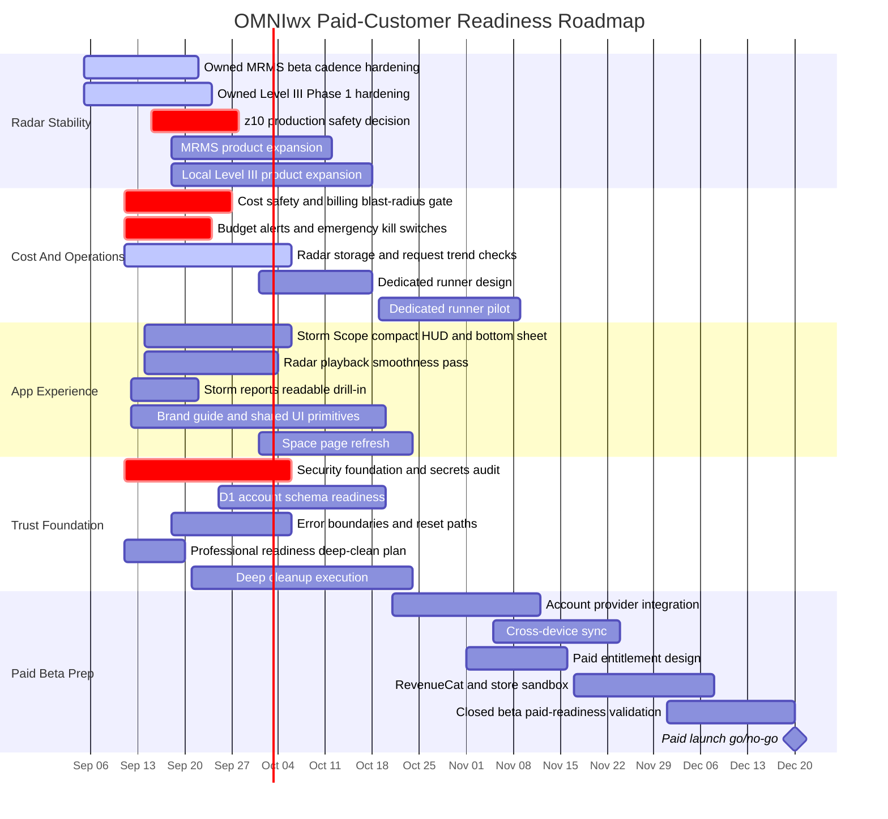

# OMNIwx Project Gantt

Last updated: September 11, 2026

This is the planning view for where OMNIwx is now and where it is going. It is not a promise of exact ship dates; it is the working execution map for getting from internal testing to a credible paid-customer beta without taking on runaway cost or half-finished infrastructure.

## Timeline

## Current Position

- We are in the radar stability, cost safety, and trust-foundation window.
- MRMS and owned Level III are real now, but still beta infrastructure until freshness, fallback, storage, and playback stay boring without manual rescue.
- RainViewer and IEM should remain fallbacks until owned MRMS plus owned Level III are visibly better for the beta footprint.
- D1 exists for future user/account data, but it should not become a radar hot path.
- Paid subscriptions should wait until security, account identity, D1 ownership rules, and cost controls are in place.

## Gates

- Cost gate: budget alerts, emergency disable switches, bounded radar scope, measured storage/request trends, and a rollback path exist before a dedicated runner or paid customer promise.
- Radar gate: MRMS and Level III stay fresh for several days, fallback is honest, storage remains rolling, and z10 cost is proven before z10 becomes routine production.
- Security gate: secrets audit, safe Worker errors, request IDs, validation, and future-auth placeholders are in place before accounts or payments.
- Paid gate: accounts and cross-device sync work before RevenueCat is treated as production capability.

## Near-Term Focus

1. Finish the cost-safety gate and document the emergency rollback steps.
2. Keep hardening MRMS and Level III cadence while measuring storage and requests.
3. Improve Storm Scope so radar feels like instrumentation over the map, not a dashboard covering it.
4. Add readable storm-report drill-in because that is user-facing value now.
5. Start the security and professional-readiness cleanup in small, testable slices.
