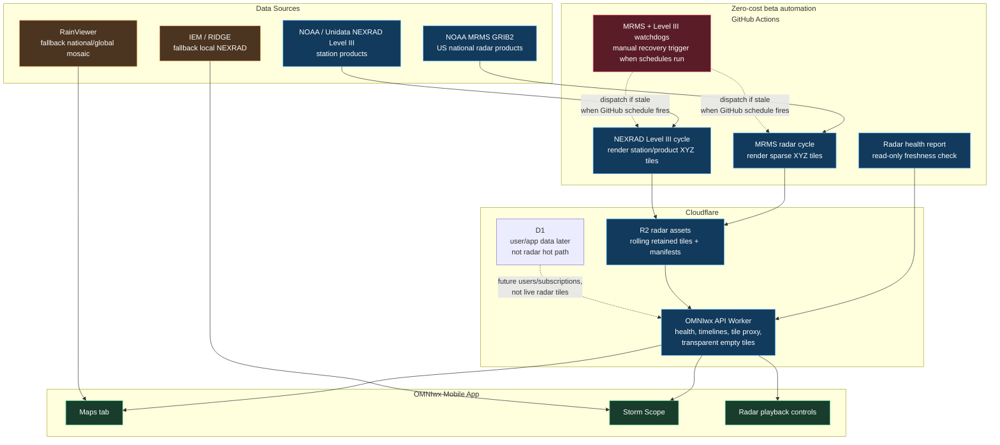
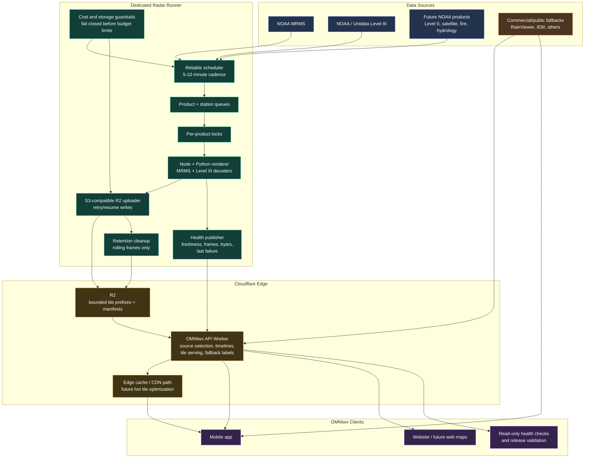

# Radar Architecture

Last updated: September 12, 2026

This diagram shows how OMNIwx radar works today and where it is going. The key idea is that the mobile app should never depend directly on raw NOAA files, GitHub jobs, or R2 internals. The app talks to the OMNIwx Worker, and the Worker decides whether owned radar is healthy enough to serve or whether fallback data should remain active.

## Current Beta Architecture

## Current Behavior

- MRMS is the owned US national radar backbone when fresh.
- Owned Level III is the local station-product beta path for selected stations/products.
- RainViewer and IEM remain fallbacks when owned data is stale, missing, warming, unsupported, or outside coverage.
- R2 stores rolling recent tiles and manifests only; it should not become an archive.
- D1 is intentionally not in the radar hot path.
- GitHub Actions can render and publish successfully, but scheduled execution can skip for hours, so it is not production-grade freshness infrastructure.

## Target Production Architecture

## Production Definition Of Done

- The dedicated runner keeps MRMS and selected Level III products fresh without manual GitHub dispatches.
- MRMS has enough frames for smooth motion, not a slow flipbook.
- Owned Level III supports the pilot stations/products with useful retained history.
- Worker/app labels make source truth obvious: owned, fallback, stale, warming, unsupported.
- R2 storage remains bounded by retention and verified cleanup.
- Cost guardrails can stop or narrow publishing before a bill surprise.
- RainViewer/IEM can remain fallbacks, but they are no longer the core radar product.
